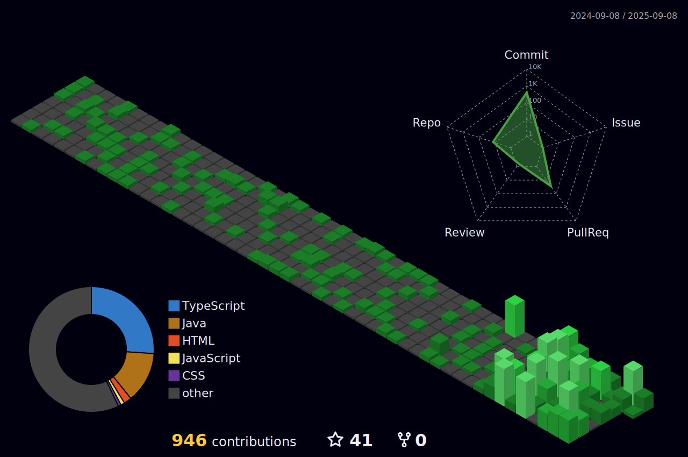

<h3 align="center">Hi, I'm Victor Moni 👋</h3>

<h3 align="center">Full Stack Developer | Problem Solver | Lifelong Learner</h3>


<div align="center">
  
</div>

<div align=center>


</div>

### ✨ About Me


💻 **Full-Stack Developer** <br/>
⚙️ **DevOps Enthusiast** <br/>
🌐 **Crafting Modern Web Applications**

I’m passionate about building **scalable, impactful, and user-friendly applications**.
Beyond coding, I see myself as a **problem solver, innovator, and lifelong learner**.

🚀 *Mission: Delivering modern applications that empower people and businesses.*

### 🔥 Current Focus


- 🌐 Full-Stack Development
- ☁️ Cloud & DevOps
- 📊 Microservices & Messaging
- 🧪 Testing & Quality

### 🌟 Core Values


- Quality and scalability over shortcuts
- Collaboration and knowledge sharing
- Continuous learning and improvement
- Empathy for end-users
- Clear and transparent communication

### 🎯 2025/2026 Goals


-  Grow my open-source portfolio
-  Achieve **Cloud certifications**
-  Publish **technical articles** and share insights on GitHub & LinkedIn
-  Mentor and collaborate with the dev community
-  Contribute to **enterprise-level microservices projects**

### 🌱 Contributions Graph



### 💻 Tech Stack


  <div align="center">
      
    <br />
  </div>

### 🏆 GitHub Trophies


<br/>

<div align="center">

  <picture>
    <source media="(max-width: 1024px)" srcset="https://github-trophies.vercel.app/?username=victormoni&theme=onedark&no-frame=true&row=2&column=4&margin-w=10&margin-h=10" />
    
  </picture>

</div>

### ⚙️ Desktop Specifications


<div align="center">


</div>

### 🔥 Productivity Heatmap


<!--START_SECTION:waka-->
**I'm an Early 🐤** 

```text
🌞 Morning                460 commits         ⬛⬛⬛⬛⬛⬛⬛⬜⬜⬜⬜⬜⬜⬜⬜⬜⬜⬜⬜⬜⬜⬜⬜⬜⬜   27.53 % 
🌆 Daytime                580 commits         ⬛⬛⬛⬛⬛⬛⬛⬛⬛⬜⬜⬜⬜⬜⬜⬜⬜⬜⬜⬜⬜⬜⬜⬜⬜   34.71 % 
🌃 Evening                373 commits         ⬛⬛⬛⬛⬛⬛⬜⬜⬜⬜⬜⬜⬜⬜⬜⬜⬜⬜⬜⬜⬜⬜⬜⬜⬜   22.32 % 
🌙 Night                  258 commits         ⬛⬛⬛⬛⬜⬜⬜⬜⬜⬜⬜⬜⬜⬜⬜⬜⬜⬜⬜⬜⬜⬜⬜⬜⬜   15.44 % 
```
📅 **I'm Most Productive on Sunday** 

```text
Monday                   229 commits         ⬛⬛⬛⬜⬜⬜⬜⬜⬜⬜⬜⬜⬜⬜⬜⬜⬜⬜⬜⬜⬜⬜⬜⬜⬜   13.70 % 
Tuesday                  253 commits         ⬛⬛⬛⬛⬜⬜⬜⬜⬜⬜⬜⬜⬜⬜⬜⬜⬜⬜⬜⬜⬜⬜⬜⬜⬜   15.14 % 
Wednesday                238 commits         ⬛⬛⬛⬛⬜⬜⬜⬜⬜⬜⬜⬜⬜⬜⬜⬜⬜⬜⬜⬜⬜⬜⬜⬜⬜   14.24 % 
Thursday                 223 commits         ⬛⬛⬛⬜⬜⬜⬜⬜⬜⬜⬜⬜⬜⬜⬜⬜⬜⬜⬜⬜⬜⬜⬜⬜⬜   13.35 % 
Friday                   229 commits         ⬛⬛⬛⬜⬜⬜⬜⬜⬜⬜⬜⬜⬜⬜⬜⬜⬜⬜⬜⬜⬜⬜⬜⬜⬜   13.70 % 
Saturday                 211 commits         ⬛⬛⬛⬜⬜⬜⬜⬜⬜⬜⬜⬜⬜⬜⬜⬜⬜⬜⬜⬜⬜⬜⬜⬜⬜   12.63 % 
Sunday                   288 commits         ⬛⬛⬛⬛⬜⬜⬜⬜⬜⬜⬜⬜⬜⬜⬜⬜⬜⬜⬜⬜⬜⬜⬜⬜⬜   17.24 % 
```


<!--END_SECTION:waka-->

### ✍️ Dev Quote


<div align="center">
  <picture>
    <source
      media="(max-width: 600px)"
      srcset="https://quotes-github-readme.vercel.app/api?type=vertical&theme=dark&heigth=400"
    />
    
  </picture>
</div>

### 📱 Connect With Me


<div align="center">

[](mailto:victor-moni@hotmail.com)
[](mailto:vabmoni@gmail.com)
[](https://wa.me/5511943936479)
[](https://discordapp.com/users/victormoni)
[](https://dev.to/victormoni)

</div>

### ☕ Support My Work


<div align="center">

[](https://www.paypal.com/donate/?hosted_button_id=QJJB8GFA7QGYW)

</div>

<div align="center">
  <b>Crafted with ❤️ by Victor Moni</b><br/>
  <sub>Let’s build something incredible together.</sub>
</div>
