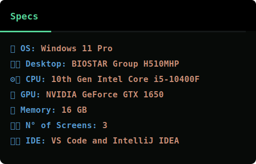

<h1 align="center">Hi, I'm Victor Moni 👋</h1>

<h3 align="center">Full Stack Developer | Problem Solver | Lifelong Learner</h3>

<div align="center">
  
</div>

<div align=center>


</div>

## ✨ About Me

💻 **Full-Stack Developer** <br/>
⚙️ **DevOps Enthusiast** <br/>
🌐 **Crafting Modern Web Applications**

I’m passionate about building **scalable, impactful, and user-friendly applications**.
Beyond coding, I see myself as a **problem solver, innovator, and lifelong learner**.

🚀 *Mission: Delivering modern applications that empower people and businesses.*

## 🌟 Core Values

- Quality and scalability over shortcuts
- Collaboration and knowledge sharing
- Continuous learning and improvement
- Empathy for end-users
- Clear and transparent communication

## 🎯 2025/2026 Goals

-  Grow my open-source portfolio
-  Achieve **Cloud certifications**
-  Publish **technical articles** and share insights on GitHub & LinkedIn
-  Mentor and collaborate with the dev community
-  Contribute to **enterprise-level microservices projects**

## 🌱 Contributions Graph


## 💻 Tech Stack

  <div align="center">
      
    <br />
  </div>

## 🏆 GitHub Trophies

  <picture>
    <source media="(max-width: 1024px)" srcset="https://github-trophies.vercel.app/?username=victormoni&theme=onedark&no-frame=true&row=2&column=4&margin-w=10&margin-h=10" />
    
  </picture>

<br/>

<div align="center">

</div>

## ⚙️ Desktop Specifications

<div align="center">



</div>

## 🔥 Productivity Heatmap

<!--START_SECTION:waka-->
**I'm an Early 🐤** 

```text
🌞 Morning                481 commits         ⬛⬛⬛⬛⬛⬛⬛⬜⬜⬜⬜⬜⬜⬜⬜⬜⬜⬜⬜⬜⬜⬜⬜⬜⬜   28.72 % 
🌆 Daytime                569 commits         ⬛⬛⬛⬛⬛⬛⬛⬛⬜⬜⬜⬜⬜⬜⬜⬜⬜⬜⬜⬜⬜⬜⬜⬜⬜   33.97 % 
🌃 Evening                369 commits         ⬛⬛⬛⬛⬛⬛⬜⬜⬜⬜⬜⬜⬜⬜⬜⬜⬜⬜⬜⬜⬜⬜⬜⬜⬜   22.03 % 
🌙 Night                  256 commits         ⬛⬛⬛⬛⬜⬜⬜⬜⬜⬜⬜⬜⬜⬜⬜⬜⬜⬜⬜⬜⬜⬜⬜⬜⬜   15.28 % 
```
📅 **I'm Most Productive on Sunday** 

```text
Monday                   228 commits         ⬛⬛⬛⬜⬜⬜⬜⬜⬜⬜⬜⬜⬜⬜⬜⬜⬜⬜⬜⬜⬜⬜⬜⬜⬜   13.61 % 
Tuesday                  245 commits         ⬛⬛⬛⬛⬜⬜⬜⬜⬜⬜⬜⬜⬜⬜⬜⬜⬜⬜⬜⬜⬜⬜⬜⬜⬜   14.63 % 
Wednesday                241 commits         ⬛⬛⬛⬛⬜⬜⬜⬜⬜⬜⬜⬜⬜⬜⬜⬜⬜⬜⬜⬜⬜⬜⬜⬜⬜   14.39 % 
Thursday                 223 commits         ⬛⬛⬛⬜⬜⬜⬜⬜⬜⬜⬜⬜⬜⬜⬜⬜⬜⬜⬜⬜⬜⬜⬜⬜⬜   13.31 % 
Friday                   241 commits         ⬛⬛⬛⬛⬜⬜⬜⬜⬜⬜⬜⬜⬜⬜⬜⬜⬜⬜⬜⬜⬜⬜⬜⬜⬜   14.39 % 
Saturday                 229 commits         ⬛⬛⬛⬜⬜⬜⬜⬜⬜⬜⬜⬜⬜⬜⬜⬜⬜⬜⬜⬜⬜⬜⬜⬜⬜   13.67 % 
Sunday                   268 commits         ⬛⬛⬛⬛⬜⬜⬜⬜⬜⬜⬜⬜⬜⬜⬜⬜⬜⬜⬜⬜⬜⬜⬜⬜⬜   16.00 % 
```


<!--END_SECTION:waka-->

## 📱 Connect With Me

<br/>

<div align="center">

[](mailto:vabmoni@gmail.com)
[](https://roadmap.sh/u/victormoni)
[](https://wa.me/5511943936479)
[](https://discordapp.com/users/victormoni)
[](https://stackoverflow.com/users/9859219)
[](https://dev.to/victormoni)
[](https://www.kaggle.com/vabmoni)
[](https://codepen.io/victormoni)
[](https://app.daily.dev/victormoni)
[](https://gitlab.com/victormoni)
[](https://bsky.app/profile/victormoni.bsky.social)
[](https://victormoni.atlassian.net/)
[](https://bitbucket.org/victormoni)
[](https://www.geeksforgeeks.org/user/victormoni/)
[](https://mastodon.social/@victormoni)


</div>

## ✍️ Dev Quote

<div align="center">
  <picture>
    <source
      media="(max-width: 600px)"
      srcset="https://quotes-github-readme.vercel.app/api?type=vertical&theme=dark&heigth=400"
    />
    
  </picture>
</div>

## ☕ Support My Work

<div align="center">

<a href="https://www.buymeacoffee.com/victormoni" target="_blank"></a>

</div>

<div align="center">
  <b>Crafted with ❤️ by Victor Moni</b><br/>
  <sub>Let’s build something incredible together.</sub>
</div>
